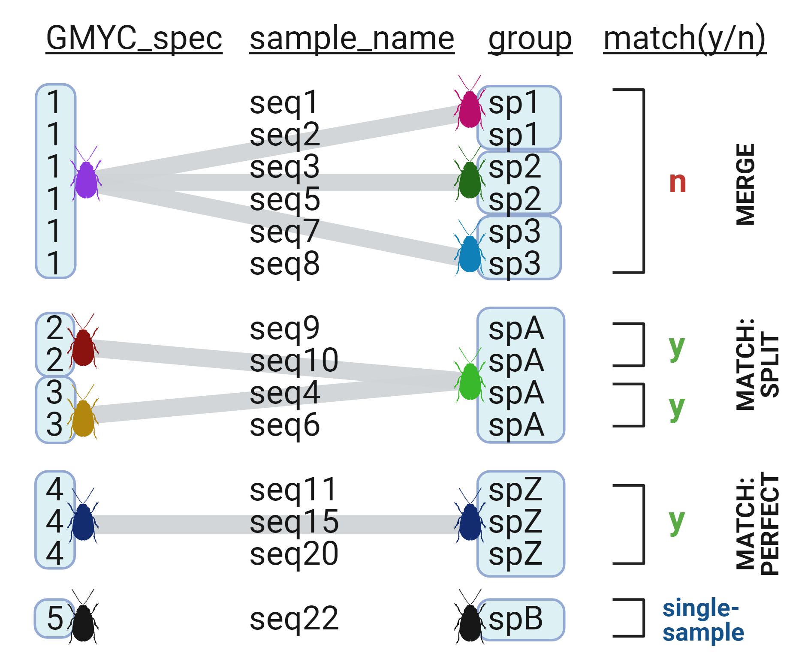
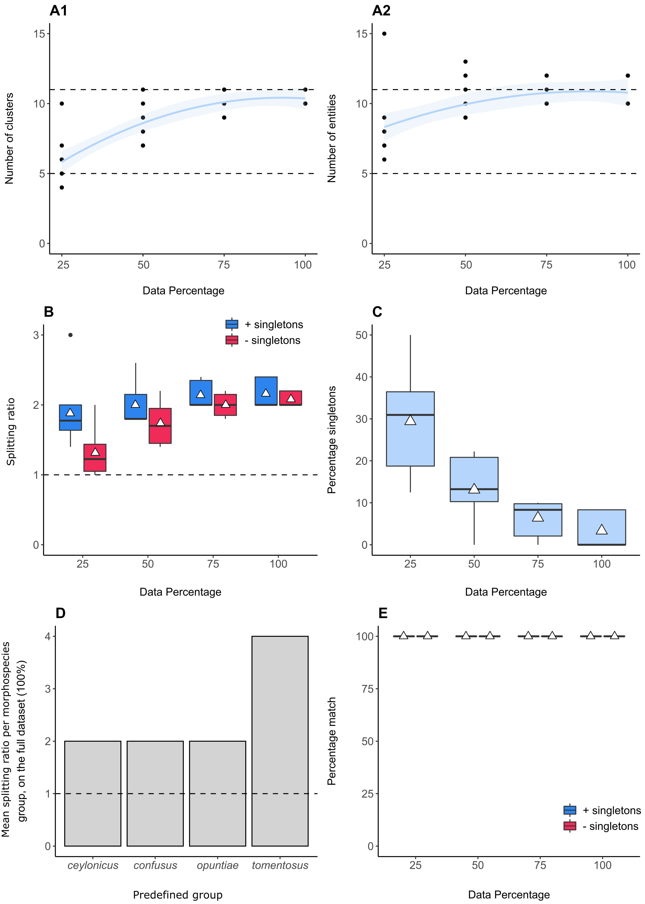

*Clarke van Steenderen* <br />
*Department of Zoology and Entomology* <br />
[*The Centre for Biological Control*](https://www.ru.ac.za/centreforbiologicalcontrol/) <br />
*Rhodes University, Grahamstown/Makhanda, Eastern Cape, South Africa* <br />
*2021* <br />
*e-mail:* vsteenderen@gmail.com

---

## **OVERVIEW** 📑

This R Shiny App offers an analysis pipeline for assessing how sampling effects and paramater choices can affect the results of a Generalised Mixed Yule Coalescent (GMYC) analysis. 
The pipeline begins with the uploading of an aligned FASTA file, where a chosen percentage of the dataset is randomly resampled *n* times without replacement. Resampling can be done with guidance from user-predefined groups (e.g. morphospecies assignments), such that at least one representative sequence per group is present in the final selection.
BEAST .XML files are then generated for each resampled FASTA alignment, where the user can apply desired configuration settings. Each .XML file is run in BEAST, and the results fed into TreeAnnotator. Maximum clade credibility trees are then used as input for GMYC analyses (single or multiple threshold).
If the user has predefined grouping data for their samples, this can be uploaded as an Excel .csv file. These predefined groups are compared to the groups estimated by the GMYC analysis, and percentage matches calculated.

This application outputs:
1. The number of clusters and entities estimated by the GMYC method for the uploaded data
2. The percentage matches between predefined groupings and GMYC species estimates; with and without GMYC species represented by single-samples (= singletons)
3. The percentage of exact GMYC matches and merges
4. Overall splitting ratios (the ratio of the number of GMYC species to predefined groups)
5. Which predefined groups were split into more than one GMYC species, indicating possible undiscovered diversity
6. Summary ggplots that are customisable

## **HOW TO RUN THE R SHINY APPLICATION** ⚙️

1. Download and unzip the **spede_sampler_R** GitHub repository, and save it in a desired directory.
2. Open R, and install (if applicable) the `shiny` library:

```r
install.packages("shiny")
```

3. Install the Bioconductor package:

```r
if (!requireNamespace("BiocManager", quietly = TRUE))
    install.packages("BiocManager")

BiocManager::install("Biostrings")
```

4. Ensure that the `rJava` package is installed. See [here](https://github.com/ropensci/beastier/blob/master/doc/rjava.md) for issues regarding rJava installation.
5. Install `beastierinstall` in order to load BEAST2:

```r
remotes::install_github("richelbilderbeek/beastierinstall")
beastierinstall::install_beast2()
```

6. Change the working directory to the downloaded folder
7. Run the application using the **runApp()** function

``` r
setwd("path/to/spede_sampler_R-main")
shiny::runApp(appDir = getwd())
```
## **POSSIBLE ISSUES AND HOW TO FIX THEM** 🔧
 
| PROBLEM | FIX |
|---------|-----|
| namespace ‘ellipsis’ 0.3.1 is already loaded, but >= 0.3.2 is required | Restart R |
| JAVA_HOME cannot be determined from the Registry        |  Install the correct version of Java relative to your version of R (e.g. 64-bit versions for both)  |
| Ubuntu: issues with installing `Biostrings` | `source("https://bioconductor.org/biocLite.R")`     `BiocInstaller::biocLite("Biostrings")` |
| Ubuntu: issues with installing `beastierinstall` | Install the `usethis` and `devtools` packages|
| Ubuntu: issues with installing the `usethis` and/or `devtools` packages | Install `libcurl`: sudo apt-get install libcurl4-openssl-dev |

Other issues may be resolved by ensuring that you are using an updated version of R.
 
Contact me at vsteenderen@gmail.com if you encounter a different problem.

## **DEFINITIONS** 📚

|TERM | DEFINITION |
|---------|-----|
|**Clusters** | The number of delimited groups comprising two ore more samples, excluding singletons. |
|**Entities** | The number of delimited groups comprising two ore more samples, including singletons. |
|**Exact match**| An instance during scoring when all the samples belonging to a particular user-defined group (morphospecies or other user-defined group) correspond to the same GMYC species. |
|**Split match**| An instance during scoring when the samples belonging to a particular user-defined group (morphospecies or other user-defined group) are split into two ore more GMYC species groups. This indicates the possibility of the underestimation of species richness by the user. |
|**Match (y/n)**| A means of denoting, in the work-through of the R code, whether there is agreement or not between a user's predefined group and a single corresponding GMYC species. |
|**Merge**| An instance during scoring when two or more user-defined groups are merged into one GMYC species group. This indicates the possibility of an overestimation of species richness by the user. |
|**Oversplitting**| The outcome where the GMYC model has estimated more species than those estimated by the user (= "discordant splitting"). This could mean either (1) the incorrect splitting into too many species, or (2) the genuine presence of undiscovered biodiversity or cryptic species. |
| **Undersplitting**| The outcome where the GMYC model has estimated fewer species than those estimated by the user. This could mean either (1) the incorrect merging into too few species, or (2) the genuine presence of lower biodiversity than expected (e.g. variations in intraspecific morphological characters mistaken for interspecific ones). |
|**Splitting ratio**| The ratio of the total number of estimated GMYC species to the total number of user-defined groups in the dataset. A value greater than one indicates oversplitting, while a value less than one denotes undersplitting. |
|**(Overall) percentage match**| The overall proportion of successful matches (records of "y") in a dataset. |
|**Singleton**| A species represented by only one individual/genetic sequence. |

# **USAGE, TAB-BY-TAB**

## Random Resampling

Insert the file path to an aligned FASTA file (.fas or .fasta extension) in the query box, set the name of the folder to which the results will be written, and then select the percentage of the dataset you wish to resample, and the number of times this must be repeated. 
Click "Resample".

For example, if your input .fas file contained the following three sequences:

```javascript
>seq1
AAAGGGTTTAA
>seq2
CCCGGGAAAGT
>seq3
GGTTTAAGGGT
```

If you wish to randomly select two of these sequences, and iterate the process four times, the program will create four .fas files, which could be for example:

**iteration1.fas:**

```javascript
>seq2
CCCGGGAAAGT
>sequence1
AAAGGGTTTAA
```

**iteration2.fas**

```javascript
>seq2
CCCGGGAAAGT
>seq3
GGTTTAAGGGT
```

**iteration3.fas**

```javascript
>seq3
GGTTTAAGGGT
>sequence1
AAAGGGTTTAA
```

**iteration4.fas**

```javascript
>seq3
GGTTTAAGGGT
>seq2
CCCGGGAAAGT
```

If you have a file containing predefined groups for your sequences (morphospecies or ecospecies for example), and wish to keep at least one representative sequence per group in the resampled files, select **Keep at least one representative sequence per predefined group** from the dropdown menu under **Select resampling approach**. This will enable you to upload your Excel .CSV file. Click **Confirm file** once you have uploaded the desired file. Select which column contains the group designations, and which contains the sequence names. Click **Resample**. Scroll down to the **GMYC Analysis** section below to see an example of the format the .CSV file should be in.

## BEAST XML Files

Insert the filepath to the folder containing your randomly-resampled FASTA files. Select the appropriate site and clock model, clock rate, tree prior, distribution rates, MCMC value, and the interval at which to store trees. Insert a name for the folder to which results are written. Click **Generate**.

## Run BEAST

Insert the filepath to the folder containing the desired .XML files, optionally select **Run BEAGLE**, and click **Run BEAST2**. For very large alignment files, it is advisable to delegate this task to [CIPRES](https://www.phylo.org/), and to download the resulting .trees files for further processing.

## Run LogCombiner

This is an optional function to reduce the size of the .trees files generated by BEAST. Set the resampling frequency to a higher multiple of the original value set as **store every** in the generation of the .XML file.

## Run TreeAnnotator

Insert the file path to the folder containing the .trees output from BEAST (or LogCombiner if applicable). Set the desired burnin value, and the **Heights** category. It is advisable to leave the **Low Memory?** option checked. Click **Run**.

## Run Tracer

Insert the file path to the folder containing the log files generated by BEAST, set the desired burnin and sample interval values, and select the log file of interest. Click **Results**. Check that ESS scores are greater than 200, and that the trace plot resembles a "hairy caterpillar".

## GMYC Analysis

Insert the file path containing the .NEX files created by TreeAnnotator. Select the desired GMYC threshold (single is recommended).

To upload predefined grouping information, browse for the relevant .CSV file. 

The .CSV file needs to contain a column for sample names, and one for their corresponding predefined groups. For example:

| sample_id | group | province |
|-----------|-------| -------  |
| MN1234    | sp1   | SW       |
| MN1235    | sp1   | SE       |
| MN1236    | sp3   | NW       |

<br />

Where only the first two columns are of interest, and the **group** column could be, for example, morphospecies. It does not matter what order the columns are in, as the application provides a dropdown list of all the columns, where you need to select which column contains groups, and which contains the sequence names. Note that the sequence names in this file need to match those in the FASTA file alignment exactly.

Click the **Confirm file** button once the file has uploaded.
Select which column comprises the groups, and which is the sample name column from the dropdown menus.

Click the **Run GMYC** button to start the GMYC analysis. 

Matches between user-defined groups and GMYC species are recorded as "yes" or "no", where "yes" outcomes can be either splits, or exact matches. "No" outcomes are treated as merges. A merge is recorded even if one of the groups contains a singleton (merge type II).

## EXPLANATION OF GMYC METRIC CALCULATIONS

**In the diagram below:**

🐛 Species 1 (sp1), 2 (sp2), and 3 (sp3) would be flagged as being merged (merge type I)

🐛 Species A (SpA) would be flagged as being oversplit by the GMYC by a factor of 2, since the GMYC split it into two separate groups (GMYC_spec 2 and 3)

🐛 Species Z (spZ) would be recorded as an exact match for this particular GMCY run. In a hypothetical scenario, if a total of three GMYC analyses were run, where species Z is recorded as an exact match in two of the runs, then Species Z would have a 67\% exact match score (i.e. exact match score = Σ (exact match count)/number of input files x 100 = 2/3 x 100 = 67\%). Overall, with species Z being the only group with an exact match, the exact match incidence in the dataset = (number of user-defined groups with a recorded exact match)/(number of user-defined groups) = 1/8 = 13\%.

🐛 Species B (spB) would be recorded as a singleton. 

🐛 Species Y (spY) and species W (spW) would also be recorded as a merge, even though spW is a singleton (merge type II). 

🐛 The splitting ratio including singletons would be calculated as: the number of GMYC species/user-defined groups = 6/8 = 0.75. The splitting ratio excluding singletons would be: (GMYC species - singletons)/user-defined groups = (6-1)/8 = 0.63. Since these values are less than the expected value of 1 (where there is no oversplitting), one can conclude that the GMYC is undersplitting species, or "merging" user-defined groups. In other words, the user has likely overestimated the number of species in their dataset.

🐛 The overall percentage match, including singletons = Σ (y) + Σ (singletons)/( Σ (y) + Σ (n) + Σ (singletons) ) = (3 + 1)/(3 + 2 + 1) = 0.67. 
Excluding singletons, the percentage match = Σ (y)/( Σ (y) + Σ (n) ) = 3/(3 + 2) = 0.6. This suggests that the inclusion of singletons resulted in a slightly inflated percentage match score.

🐛 The percentage of singletons = Σ (singletons)/number of GMYC species = 1/6 = 17\%. 



## View Data

**Print all data to the screen** prints the number of clusters and entities and clusters for each tree file, and **Print summary statistics to the screen** displays the mean, standard deviation, and minimum and maximum values for all the data.

When downloading, add the .csv extension manually to the file name.

## Plot Results

Display and plot the results for:

- The number of clusters vs the number of entities as a scatter plot
- A boxplot for the numbers of clusters and entities
- The number of clusters and entities estimated by each ML iteration file

## Plot Trees

Plot any individual GMYC tree with GMYC support values.

## Percentage Matches

Select any input tree file, and navigate to the **View GMYC species list** panel to view the GMYC results table with the appended predefined groups.
If any of your predefined groups have been merged, these will be listed in the panel by their *GMYC_spec number* in the particular selected tree file.
Navigate to **View Matches** to view the percentage match including and excluding single-sample GMYC-species, the percentage of single-sample GMYC species, and the oversplitting ratio including and excluding single-sample GMYC-species. 
The **View Matches Summary** section displays the average, standard deviation, and minimum and maximum values for the above statistics.

## Plot Percentage Matches

Plot the percentage match (GMYC species to predefined groups) for each tree file as a line graph.

## GMYC splitting

The **View summary** button in the **View output** panel displays the mean, standard deviation, and minimum and maximum values for the predefined groups that have been split into more than one species/groups by the GMYC algorithm. The "View full" button gives a table with all the predifined groups that were split into more than one group across all trees.
These data can be plotted as box-and-whisker or bar plots.

## GMYC Exact Matches

This tab allows you to see which of your predefined groups are exact GMYC matches, and in how many of the GMYC results this occurred. For example, if you had 10 tree files, a record will be kept of the number of times that each predefined group registered as an exact match across the 10 GMYC results. This is outputted as a percentage in the summary table.
Text will appear in the panel to report what percentage of your predefined groups were exact matches.

## Amalgamate
Upload multiple .csv files containing the output downloaded from the **Percentage Matches** tab. These have the following column layout (e.g. the output for a 50% resampled dataset):

| filename        | percentage_match    | percentage_match_excl_singles   | percentage_single_sample_GMYC_species   | splitting_ratio   | splitting_excl_singles |
|-----------      |-------|----- |----- |----- | ----- |
| iteration1.tre  | 0.25  | 0.3  | 0.36 | 0.35 | 0.18 |
| iteration2.tre  | 0.4   | 0.5  | 0.48 | 0.35 | 0.25 |
| iteration3.tre  | 0.35  | 0.28 | 0.23 | 0.56 | 0.36 |
| iteration4.tre  | 0.3   | 0.58 | 0.21 | 0.33 | 0.25 |

And an example of the output from a 60% resampled dataset:

| filename        | percentage_match    | percentage_match_excl_singles   | percentage_single_sample_GMYC_species   | splitting_ratio   | splitting_excl_singles |
|-----------      |-------|----- |----- |----- | ----- |
| iteration1.tre  | 0.35  | 0.36 | 0.40 | 0.45 | 0.28 |
| iteration2.tre  | 0.45  | 0.58 | 0.65 | 0.85 | 0.36 |
| iteration3.tre  | 0.5   | 0.38 | 0.26 | 0.66 | 0.42 |
| iteration4.tre  | 0.45  | 0.68 | 0.28 | 0.35 | 0.2  |

Select which data column you wish to extract from the dropdown menu. The algorithm pulls the desired column data from each uploaded file and binds them into one dataframe. This can then be plotted as a line graph with standard deviations. The **percentage_match** data (first column in the above examples) from the 50% and 60% resampled data will look like this:

| filename        | 50    | 60   | 
|-----------      |-------|----- |
| iteration1.tre  | 0.25  | 0.35 | 
| iteration2.tre  | 0.4   | 0.45 | 
| iteration3.tre  | 0.35  | 0.5  | 
| iteration4.tre  | 0.3   | 0.45 | 

Download this as a .csv file.

## Summary Plots
Upload the desired dataframe downloaded from the **Amalgamate** tab in the appropriate panel (Clusters and Entities, Splitting Ratios, Percentage Matches, Percentage Singletons, Splitting Ratios per Predefined Group) and apply the desired plot settings/tweaks for each. For a combined plot, scroll to the **Multi-Plots** panel, and click **Plot All**. Each plot can be downloaded as a PDF, PNG, or SVG file with desired sizes.

## :pencil2: **Worked Example using cochineal 12S sequences**

📌 The [**SPEDE_SAMPLER_DATA**](https://drive.google.com/drive/folders/1IwT4yDOZtkMAMeUpnpovfU2tzsvyUUbU?usp=sharing) folder contains all the results of this worked example (i.e. the output of the SPEDE-Sampler R shiny application). Sequences were randomly resampled for 25, 50, 75, and 100% of the 142 cochineal insect sequences in the **12S_aligned.fas** file. Each subsampled dataset contains 10 iterations (performed with a set seed for reproducibility). The **cochineal_ids.csv** file contains predefined species designations for each sequence based on the host plant the specimen was collected from (the cochineal insects display high host-specificity, where a particular species will typically only feed on one cactus species). See the associated [journal article](https://www.sciencedirect.com/science/article/pii/S1049964420306538) for more information about these insects and genetic sequences. There are currently 11 described cochineal species, four of which are used as biological control agents for invasive cactus species. These are *Dactylopius opuntiae*, *D. tomeontosus*, *D. ceylonicus*, and *D. austrinus*. *Dactylopius opuntiae* comprises the "ficus" and "stricta" lineages, and *D. tomentosus* comprises lineages including "cholla", "imbricata", "californica var. parkerii", "bigelovii", and "cylindropuntia".

**Steps:**

1. Download the **12S_aligned.fas** file. 
2. Open the SPEDE-SAMPLER-GMYC R Shiny application using the instructions at the start of this README
3. Upload the **12S_aligned.fas** file in the **Random resampling** tab in the application. Change the **percentage of sequences to resample** to 25%, the **number of iterations** to 10, and select **Set a seed**. Click **Resample**. For the remainder of these instructions, repeat the process for 50, 75, and 100% of the data, changing the output folder names accordingly where appropriate (e.g. RESAMPLED_FASTA_FILES_25, RESAMPLED_FASTA_FILES_50, RESAMPLED_FASTA_FILES_75, and RESAMPLED_FASTA_FILES_100).
4. In the **BEAST XML Files** tab, insert the file path to the folder containing the resampled FASTA files of 25% of the dataset (to get the filepath, right-click on any of the fasta files --> Properties --> Copy the address in "Location"). Leave the default settings as they are, changing only the **MCMC** to 5 000 000, and the output folder name. Click **Generate**. This will generate a folder containing an XML file for each resampled FASTA file.
5. Either run BEAST2 from the **Run BEAST** tab by inserting the file path to the folder containing the desired .XML files, or upload the .XML files to CIPRES and run the analyses on the external server. This is much quicker than running it on your local machine, but slightly more admin. 
6. In the **Run TreeAnnotator** tab, insert the file path to the folder containing the .TREES files generated by BEAST. Leave the burnin at 25%, the heights on **median**, and the **Low Memory?** button checked. Click **Run**.
7. In the **Tracer** tab, check for MCMC convergence, and that ESS scores > 200 for the inputted log files. 
8. In the **GMYC** analysis tab, insert the file path to the folder containing the .TREES files generated by TreeAnnotator. Select the single threshold option.
9. Under **Upload a csv file with prior grouping information:**, click **Browse**, and select the **cochineal_ids.csv** file.
10. Under the **Select Group Column:** dropdown menu, select **predefined_group**. Leave the **Select Smaple Name Column** selected from the second dropdown menu.
11. Click the **RUN GMYC** button.
12. Once the analysis is complete, select the **View Data** tab. 
13. The **Print** button in the **Print all data to the screen** displays the number of clusters and entities recorded for each of the 10 iteration files, and the **Print** button in the **Print summary statistics to the screen** panel displays the average, standard deviation, minimum, and maximum values for this data. Both of these dataframes can be downloaded as .csv files. These are the results using the 75% resampled data:

| statistic        | clusters    | entities   | 
|-----------      |-------|----- |
| Average  | 10.0  | 10.7 | 
| Standard deviation  | 0.82   | 0.95 | 
| Minimum  | 9.00  | 10.00  | 
| Maximum  | 11.00   | 12.00 | 

14. The **Plot Results** tab allows for the plotting of the the number of clusters vs entities for each tree file, box-and-whisker plot for the clusters and entities (showing Q1, Q3, median, minimum, maximum, and outlier values), and a line graph for the number of GMYC clusters and entities for each tree file uploaded.

15. The **Plot Trees** tab allows for the plotting of any tree from those uploaded. The user can select whether the original FastTree or RAxML bootstrap or GMYC support values should be displayed. 

16. The **Percentage Matches** tab reports whether there were any merges, and the results of how the GMYC species designations compare to the predefined groups in the **cochineal-ids.csv** file. Using the 75% cochineal dataset, there were no merges recorded.
The **View GMYC species list** button shows a datatable containing each sample name with the assigned GMYC species. The corresponding predefined group given to that particular sample is appended as a third column. For example:

| GMYC_spec | sample_name | ids | 
| ----------- | ----------- | ----------- |
| 1 | VS086uOE | opuntiae |
| 1 | VS086uOE | opuntiae |
| 1 | VS017Ofi | opuntiae |
| 1 | VS015Ofi | opuntiae |
| 1 | CSW004E | opuntiae |

The **View Matches** button displays the percentage matches including and excluding single-sample representatives, the percentage of GMYC species represented by a single sample, and the splitting ratio including and excluding single-sample GMYC species. The **View Matches Summary** shows the average, standard deviation, minimum, and maximum values for these measures. 

| statistic        | percentage_matches    | percentage_matches_excl_single_samples   | percentage_single_sample_GMYC_species | splitting_ratio | splitting_ratio_excl_single_sample_spp |
|--------             |-------|----- |----- |----- |----- |
| Average             | 100.00  | 100.00 | 6.41 | 2.41 | 2.00 |
| Standard deviation  | 0.00  | 0.00 | 4.47 | 2.61 | 0.16 |
| Minimum             | 100.00  | 100.00  | 0.00  | 2.00 | 1.80 |
| Maximum             | 100.00 | 100.00 | 10.00| 2.40 | 2.20 |

17. The **Plot Percentage matches** tab allows for the plotting of the percentage match; A) including or B) excluding GMYC single-sample species for each tree file.

18. The **GMYC Splitting** tab displays GMYC species splitting relative to the user's predefined groups. The **View Summary Table** button allows the user to download the mean, standard deviation, minimum and maximum splitting values for each predefined group.

| predefined_group        | mean    | sd   | min | max |
|-----------      |-------|----- |----- |----- |
| ceylonicus  | 2 | 0 | 2 | 2 |
| confusus  | 2   | 0 | 2 | 2 |
| opuntiae  | 2  | 0 | 2 | 2 |
| tomentosus  | 3.9  | 0.32  | 3 | 4 |

The output above means, for example, that the GMYC method oversplit the *Dactylopius tomentosus* predefined group into an average of 3.9 times more 'species' than expected (i.e. all the samples with the predefined group labelled "tomentosus" are expected to be grouped into one species by the GMYC method). The *D. tomentosus* sequences in this dataset are known to contain different lineages/biotypes. The high value of 3.9 may therefore not be a case of incorrect 'oversplitting', but rather due to genuine intraspecific divisions. Each dataset needs to be analysed in the context of what is known about the organism's biology.

19. The **GMYC Exact Matches** tab reports the overall percentage of exact matches across all GMYC runs (i.e. the number of predefined groups that were recorded as exact matches/the total number of predefined groups). The **View summary** button displays which predefined groups were recorded as exact matches in one or more of the GMYC analyses, and how many times they were scored as such. For example, across 10 GMYC runs, a particular group may have been recorded as an exact match in 6, making its overall incidence 60%.

20. The **Amalgamate** tab allows the user to upload multiple files downloaded from the **Percentage Matches**  --> **View Matches** --> **Download** button. In this way, the results of the 25, 50, 75, and 100% datasets can be joined into single files in order to be easily plotted. For example, the four files **clust_ent_data_25.csv**, **clust_ent_data_50.csv**, **clust_ent_data_75.csv**, and **clust_ent_data_100.csv** can be uploaded, and all the cluster data can be amalgamated into one file, and all the entity data into another.
The clusters summary table looks like this:

|                  | 25 | 50 | 75 | 100 |
|------------------|----|----|----|-----|
| resampled_1.nex  | 5  | 7  | 9  | 11  |
| resampled_2.nex  | 4  | 11 | 11 | 11  |
| resampled_3.nex  | 10 | 9  | 11 | 10  |
| resampled_4.nex  | 6  | 10 | 10 | 10  |
| resampled_5.nex  | 6  | 7  | 9  | 10  |
| resampled_6.nex  | 7  | 7  | 10 | 11  |
| resampled_7.nex  | 6  | 8  | 9  | 10  |
| resampled_8.nex  | 5  | 9  | 10 | 11  |
| resampled_9.nex  | 5  | 11 | 10 | 10  |
| resampled_10.nex | 4  | 8  | 11 | 10  |

and the entities table looks like this:

|                  | 25 | 50 | 75 | 100 |
|------------------|----|----|----|-----|
| resampled_1.nex  | 7  | 9  | 10 | 12  |
| resampled_2.nex  | 8  | 13 | 12 | 12  |
| resampled_3.nex  | 15 | 10 | 12 | 10  |
| resampled_4.nex  | 7  | 12 | 11 | 10  |
| resampled_5.nex  | 8  | 9  | 10 | 10  |
| resampled_6.nex  | 8  | 9  | 10 | 12  |
| resampled_7.nex  | 9  | 9  | 10 | 10  |
| resampled_8.nex  | 8  | 9  | 10 | 12  |
| resampled_9.nex  | 6  | 11 | 10 | 10  |
| resampled_10.nex | 7  | 9  | 12 | 10  |

The resulting summary plots for each measure can be plotted as shown below, using the **Summary Plots** tab. The number of A1) clusters and A2) entities at each dataset size (the dotted lines indicate the expected number of species (n = 5), and species + lineages (n = 11) in the dataset), B) The splitting ratios with and without singletons across dataset sizes (the dotted line indicates the expected ratio of 1), C) the percentage of singleton sequences across dataset sizes, D) Barplots highlighting which predefined groups were oversplit by the GMYC, and E) The percentage match scores between predefined groups and GMYC species across dataset sizes. Triangles represent mean values.



A1 and A2 indicate that the number of clusters and entities recorded approach the same number of predefined species and lineages (n = 11), and that the asymptotic shape suggests that further sampling in the same collecting areas is unlikely to yield further species or lineages.
Plot B shows that the user-defined groups were underestimates of species richness, as the average splitting ratio always exceeds a value of 1. The presence of singletons tended to result in higher splitting ratios than when they were excluded, which is more pronounced in smaller datasets (25% - 50%). Plot C shows how the percentage of singletons decreased as the dataset size increased. Plot D graphically shows the predefined groups that were oversplit by the GMYC, with *D. tomensosus* showing the greatest mean splitting ratio. Plot E shows that the overall percentage match scores, including and excluding singletons, remained high irrespective of data size.

---

## **R code** 💻
**For users who wish to further tweak their plots**

```r
library(readxl)
library(dplyr)
library(ggplot2)
library(gridExtra)

# CLUSTERS

clusters = read.csv("cochineal_12S/clust-ent-data/clusters_combined.csv", header = T, check.names = F)
clusters_melt = reshape2::melt(clusters)
colnames(clusters_melt) = c("file_name", "data_perc", "clusters")

# #ENTITIES

entities = read.csv("cochineal_12S/clust-ent-data/entities_combined.csv", header = T, check.names = F)
entities_melt = reshape2::melt(entities)
colnames(entities_melt) = c("file_name", "data_perc", "entities")

clusters_melt$entities = entities_melt$entities 

clusts_ents = reshape::melt(clusters_melt)

# BOXPLOT

clust_ent_boxplot = ggplot(data = clusts_ents, aes(x = data_perc, y = value)) + 
  geom_boxplot(aes(fill = variable)) +
  stat_summary(fun = mean, aes(group = variable), geom="point", shape=17, size=3, color="black", position=position_dodge(0.77)) +
  scale_fill_manual(values=c("#1EAD4B", "#AC72D9"), name = "", labels = c("Clusters", "Entities")) +
  xlab("Data Percentage") +
  ylab("Number of clusters or entities") +
  ggtitle("A") +
  theme_classic() +
  theme(legend.position = "bottom") +
  theme(axis.title.y = element_text(size = 12, margin = margin(t = 0, r = 20, b = 0, l = 0))) +
  theme(axis.title.x = element_text(size = 12, margin = margin(t = 20, r = 0, b = 0, l = 0))) +
  theme(axis.text.x = element_text(size = 12)) +
  theme(axis.text.y = element_text(size = 12)) +
  theme(legend.text=element_text(size=12)) +
  theme(plot.title = element_text(size=16, face = "bold")) +
  geom_hline(yintercept= 5, linetype="dashed") +
  geom_hline(yintercept= 11, linetype="dashed") ; clust_ent_boxplot
  #guides(fill=guide_legend(title=""))
  
# PLOT JUST CLUSTERS, WITH AN ACCUMULATION CURVE

clust_accum = ggplot(data = clusters_melt, aes(x = as.numeric( data_perc ), y = clusters)) + 
  geom_point() +
  geom_smooth(span = 3, col = "blue", fill = "lightblue", alpha = 0.2) +
  #geom_boxplot(fill = "#1EAD4B") +
  #stat_summary(fun = mean, geom="point", shape=17, size=3, color="black", position=position_dodge(0.77)) +
  xlab("Data Percentage") +
  ylab("Number of clusters") +
  ggtitle("A1") +
  theme_classic() +
  theme(legend.position = "bottom") +
  theme(axis.title.y = element_text(size = 12, margin = margin(t = 0, r = 20, b = 0, l = 0))) +
  theme(axis.title.x = element_text(size = 12, margin = margin(t = 20, r = 0, b = 0, l = 0))) +
  theme(axis.text.x = element_text(size = 12)) +
  theme(axis.text.y = element_text(size = 12)) +
  theme(legend.text=element_text(size=12)) +
  theme(plot.title = element_text(size=16, face = "bold")) +
  ylim(0,15) +
  geom_hline(yintercept= 5, linetype="dashed") +
  scale_x_continuous(breaks = as.numeric(clusters_melt$data_perc), labels = clusters_melt$data_perc) +
  geom_hline(yintercept= 11, linetype="dashed") ; clust_accum

# PLOT JUST ENTITIES, WITH AN ACCUMULATION CURVE

ent_accum = ggplot(data = clusters_melt, aes(x = as.numeric( data_perc ), y = entities)) + 
  geom_point() +
  geom_smooth(span = 3, col = "blue", fill = "lightblue", alpha = 0.2) +
  #geom_boxplot(fill = "#1EAD4B") +
  #stat_summary(fun = mean, geom="point", shape=17, size=3, color="black", position=position_dodge(0.77)) +
  xlab("Data Percentage") +
  ylab("Number of entities") +
  ggtitle("A2") +
  theme_classic() +
  theme(legend.position = "bottom") +
  theme(axis.title.y = element_text(size = 12, margin = margin(t = 0, r = 20, b = 0, l = 0))) +
  theme(axis.title.x = element_text(size = 12, margin = margin(t = 20, r = 0, b = 0, l = 0))) +
  theme(axis.text.x = element_text(size = 12)) +
  theme(axis.text.y = element_text(size = 12)) +
  theme(legend.text=element_text(size=12)) +
  theme(plot.title = element_text(size=16, face = "bold")) +
  ylim(0,15) +
  geom_hline(yintercept= 5, linetype="dashed") +
  geom_hline(yintercept= 11, linetype="dashed") ; ent_accum

# SPLITTING RATIOS

splitting = read.csv("cochineal_12S/match_data/splitting_ratio.csv", header = T, check.names = F)
splitting_melt = reshape2::melt(splitting)
colnames(splitting_melt) = c("file_name", "data_perc", "splitting_ratio")

splitting_excl_sing = read.csv("cochineal_12S/match_data/splitting_excl_singles.csv", header = T, check.names = F)
splitting_excl_sing_melt = reshape2::melt(splitting_excl_sing)
colnames(splitting_excl_sing_melt) = c("file_name", "data_perc", "splitting_ratio_excl")

splitting_melt$splitting_excl = splitting_excl_sing_melt$splitting_ratio_excl

splitting_combo = reshape::melt( splitting_melt )

# BOXPLOT

splitting_boxplot = ggplot(data = splitting_combo, aes(x = data_perc, y = value)) + 
  geom_boxplot(aes(fill = variable)) +
  stat_summary(fun = mean, aes(group = variable), geom="point", shape=17, size=3, color="black", position=position_dodge(0.77)) +
  scale_fill_manual(values=c("#2D86F0", "#F02D5A"), name = "", labels = c("+ singletons", "- singletons")) +
  xlab("Data Percentage") +
  ylab("Splitting ratio") +
  ggtitle("B") +
  theme_classic() +
  theme(legend.position = "bottom") +
  guides(fill=guide_legend(title="")) +
  theme(axis.title.y = element_text(size = 12, margin = margin(t = 0, r = 20, b = 0, l = 0))) +
  theme(axis.title.x = element_text(size = 12, margin = margin(t = 20, r = 0, b = 0, l = 0))) +
  theme(axis.text.x = element_text(size = 12)) +
  theme(axis.text.y = element_text(size = 12)) +
  theme(legend.text=element_text(size=12)) +
  geom_hline(yintercept= 1, linetype="dashed") +
  theme(plot.title = element_text(size=16, face = "bold")) ; splitting_boxplot

# PERCENTAGE SINGLETONS

singletons = read.csv("cochineal_12S/match_data/percentage_single_sample_GMYC_species.csv", header = T, check.names = F)
singletons_melt = reshape2::melt(singletons)
colnames(singletons_melt) = c("file_name", "data_perc", "perc_singletons")

singletons_boxplot = ggplot(data = singletons_melt, aes(x = data_perc, y = perc_singletons)) +
  geom_boxplot(fill = "#B5D5FA") +
  stat_summary(fun = mean, geom="point", shape=17, size=4, color="black", position=position_dodge(0.77)) +
  xlab("Data Percentage") +
  ylab("Percentage singletons") +
  ggtitle("C") +
  theme_classic() +
  theme(axis.title.y = element_text(size = 12, margin = margin(t = 0, r = 20, b = 0, l = 0))) +
  theme(axis.title.x = element_text(size = 12, margin = margin(t = 20, r = 0, b = 0, l = 0))) +
  theme(axis.text.x = element_text(size = 12)) +
  theme(axis.text.y = element_text(size = 12)) +
  theme(plot.title = element_text(size=16, face = "bold")) ; singletons_boxplot
  
# SPLITTING PER SPECIES

oversplits_per_group = read.csv("cochineal_12S/oversplits/mean_oversplits_per_group_full_100.csv", header = T, check.names = F)

splitting_bar = ggplot(data = oversplits_per_group, aes(x = predef_unique, y = Freq)) +
  geom_bar(stat = "summary", fill = "lightgrey", col = "black") +
  xlab("Morphospecies") +
  ylab("Mean splitting ratio per morphospecies \n group, on the full dataset (100%)") +
  theme_classic() +
  ggtitle("D") +
  theme(axis.title.y = element_text(size = 12, margin = margin(t = 0, r = 20, b = 0, l = 0))) +
  theme(axis.title.x = element_text(size = 12, margin = margin(t = 20, r = 0, b = 0, l = 0))) +
  theme(axis.text.x = element_text(size = 12)) +
  theme(axis.text.y = element_text(size = 12)) +
  theme(plot.title = element_text(size=16, face = "bold")) +
  geom_hline(yintercept= 1, linetype="dashed") 


# PERCENTAGE MATCHES

percentage_matches = read.csv("cochineal_12S/match_data/percentage_match.csv", check.names = F)
percentage_matches_m = reshape2::melt(percentage_matches)

percentage_matches_excl_s = read.csv("cochineal_12S/match_data/percentage_match_excl_singles.csv", check.names = F)
percentage_matches_excl_s_melt = reshape2::melt(percentage_matches_excl_s)

percentage_matches_m$ex_sing = percentage_matches_excl_s_melt$value
colnames(percentage_matches_m) = c("file_name", "data_perc", "inc_singletons", "ex_singletons")
percentage_matches_combo = reshape2::melt(percentage_matches_m)

perc_match_boxplot = ggplot(data = percentage_matches_combo, aes(x = data_perc, y = value)) + 
  geom_boxplot(aes(fill = variable)) +
  stat_summary(fun = mean, aes(group = variable), geom="point", shape=17, size=3, color="black", position=position_dodge(0.77)) +
  scale_fill_manual(values=c("#2D86F0", "#F02D5A"), name = "", labels = c("+ singletons", "- singletons")) +
  xlab("Data Percentage") +
  ylab("Percentage match") +
  ggtitle("E") +
  theme_classic() +
  theme(legend.position = "bottom") +
  guides(fill=guide_legend(title="")) +
  theme(axis.title.y = element_text(size = 12, margin = margin(t = 0, r = 20, b = 0, l = 0))) +
  theme(axis.title.x = element_text(size = 12, margin = margin(t = 20, r = 0, b = 0, l = 0))) +
  theme(axis.text.x = element_text(size = 12)) +
  theme(axis.text.y = element_text(size = 12)) +
  theme(legend.text=element_text(size=12)) +
  ylim(0,100) +
  theme(plot.title = element_text(size=16, face = "bold")) ; perc_match_boxplot 

# COMBINE THE PLOTS

combo_plots = gridExtra::grid.arrange(clust_accum,
                                      ent_accum,
                                      splitting_boxplot, 
                                      singletons_boxplot, 
                                      splitting_bar, 
                                      perc_match_boxplot)

# SAVE THE OUTPUT

ggsave(plot = combo_plots, width = 25, height = 35, dpi = 350, filename = "combo_plots_cochineal.svg", units = "cm")
```
