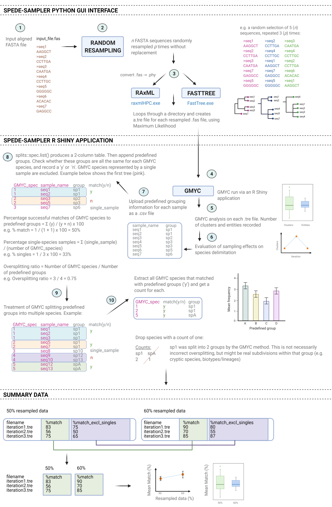
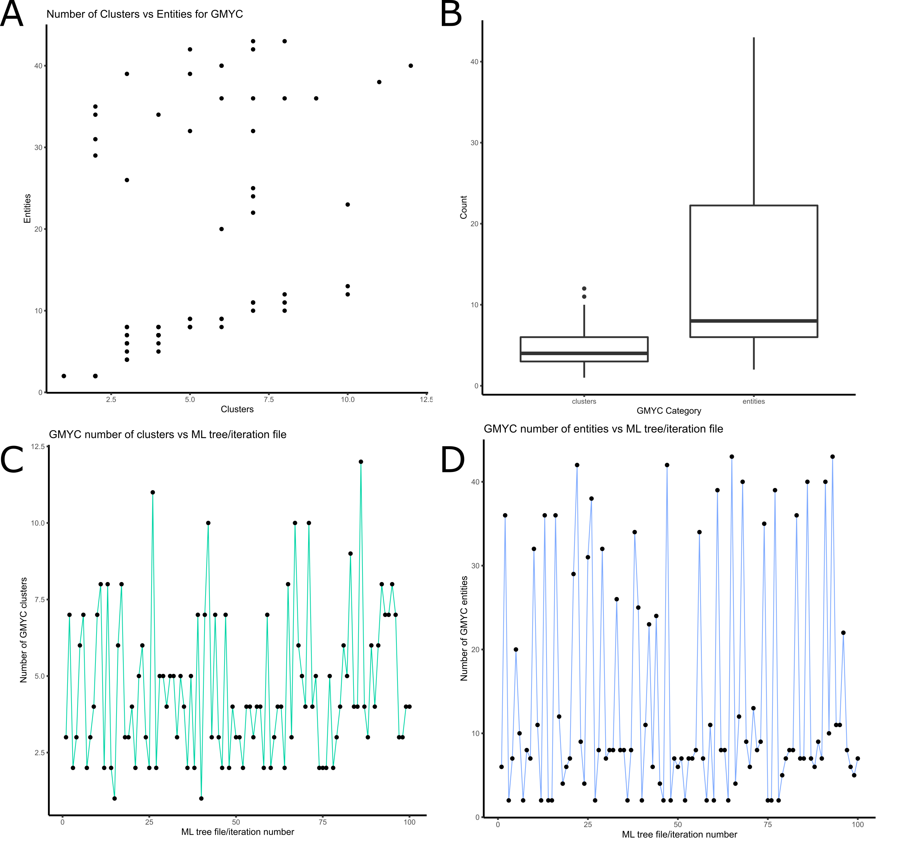
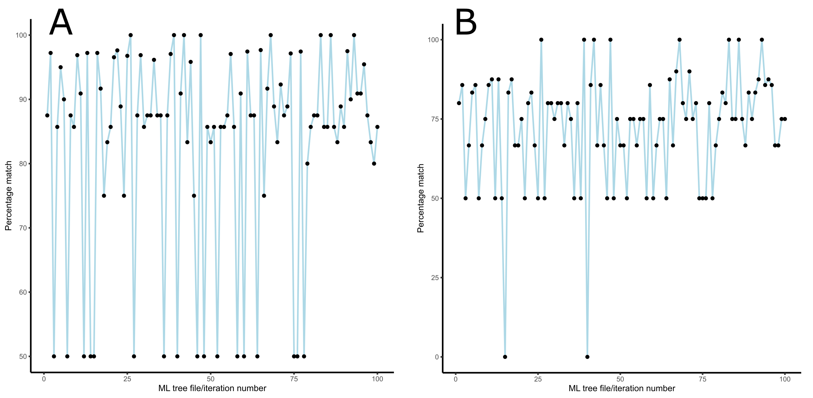
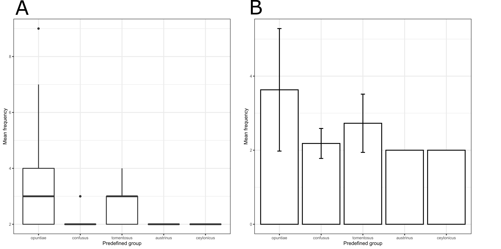
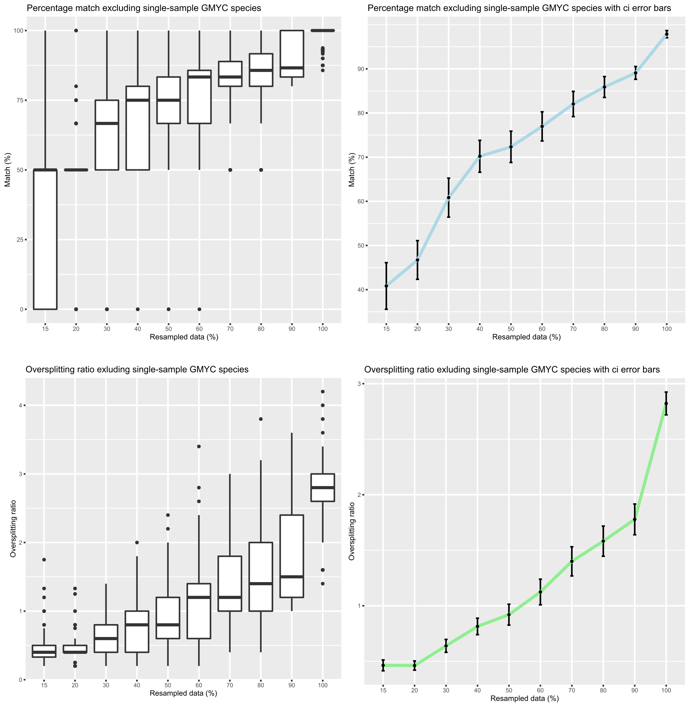
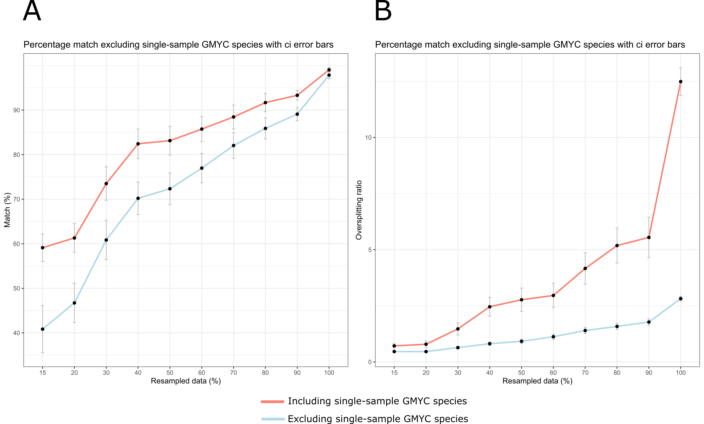
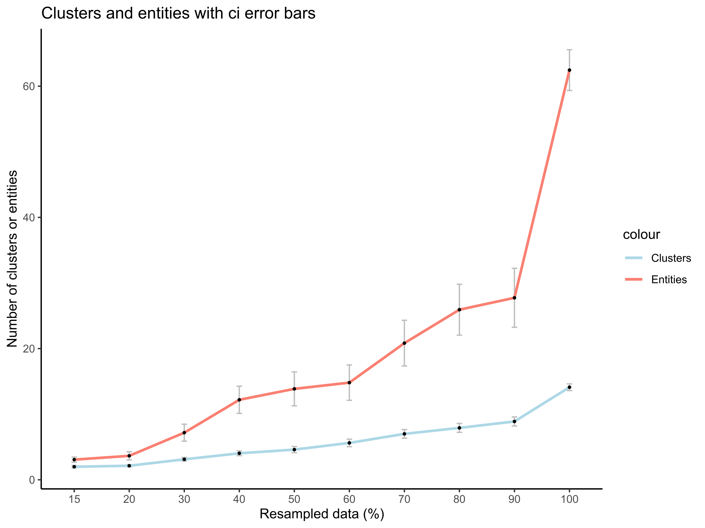

*Clarke van Steenderen*  
*Department of Zoology and Entomology*  
[*The Centre for Biological Control*](https://www.ru.ac.za/centreforbiologicalcontrol/)  
*Rhodes University, Grahamstown, Eastern Cape, South Africa*  
*2021*  
*e-mail:* vsteenderen@gmail.com

---

## **HOW TO RUN THE APPLICATION**

To run this app through R, type the following into the console:

`install.packages("shiny") # install the shiny package` 

`library(shiny) # load up the shiny library` 

`shiny::runGitHub("spede-sampler", "CJMvS", ref="main") # run the app`

## **OVERVIEW**

This R Shiny App is the final step of the analysis pipeline following from the [SPEDE-SAMPLER Python program](https://github.com/CJMvS/spede-sampler-py) (see the diagram below). The application requires the user to input a folder directory containing all the tree files created by FastTree or RAxML. If the user wishes to run the analysis on only one tree, this tree file needs to be saved into a folder first, which can then be selected.
Using the "ape" package, each tree is opened and converted to become fully dichotomous (**multi2di()** function) and ultrametric (**chronos()** function).
The GMYC species delimitation algorithm is then run on each tree using the R "splits" package. 
If the user has predefined grouping data for their samples, this can be uploaded as an Excel .csv file. These predefined groups are then compared to the groups estimated by the GMYC analysis, and a percentage match is calculated.
This application outputs:
1. The number of clusters and entities estimated by the GMYC method for the uploaded data
2. The percentage matches between predefined groupings and GMYC species estimates; with and without GMYC species represented by single-samples
3. Oversplitting ratios (the ratio of the number of GMYC species to predefined groups)
4. Which predefined groups were split into more than one GMYC species 
5. Summary plots for the results of multiple GMYC results 

## **FUNCTIONALITY FLOW DIAGRAM**

# **USAGE, TAB-BY-TAB**

## :green_book: Home: multiple ML trees

Select a folder, or manually input the file path containing the files created by either FastTree or RAxML. 
Select the approapriate radio button to indicate which ML program was used to create your tree files.
The file path will display on the screen as confirmation of your choice.

To upload predefined grouping information, browse for the relevant .csv file. 

The csv file needs one column for sample names, and another for their corresponding predefined groups. For example:

| sample_id | group |
|-----------|-------|
| MN1234    | sp1   |
| MN1235    | sp1   |
| MN1236    | sp3   |

 

Where the **group** column could be, for example, morphospecies.
Select which column is the grouping, and which is the sample name column from the dropdown menus.

Click the "Run" button to start the GMYC analysis. 

## :green_book: View Data

"Show all data" prints the number of clusters and entities and clusters for each tree file, and "Show summary table" displays the mean, standard deviation, and minimum and maximum values for all the data.

When downloading, add the .csv extension manually to the file name.

## :green_book: Plot Results

Display and plot the results for:

- The number of clusters vs the number of entities as a scatter plot
- A boxplot for the numbers of clusters and entities
- The number of clusters and entities estimated by each ML iteration file

When downloading these plots, add the .svg extension to the file name.

## :green_book: Plot Trees
Plot any individual GMYC tree with GMYC support values, or original bootstrap support values.

## :green_book: Percentage Matches
Select any input tree file, and click on the "View GMYC species list" button to view the GMYC results table with the appended predefined groups (as uploaded by the user).
Click on "View Matches" to view the percentage match including and excluding single-sample GMYC-species, the percentage of single-sample GMYC species, and the oversplitting ratio including and excluding single-sample GMYC-species. 
The "View Matches Summary" button displays the average, standard deviation, and minimum and maximum values for the above statistics.

## :green_book: Plot Percentage Matches
Plot the percentage match (GMYC species to predefined groups) for each tree file as a line graph.

## :green_book: GMYC Oversplitting
The "View Summary Table" button displays the mean, standard deviation, and minimum and maximum values for the predefined groups that have been split into more than one species/groups by the GMYC algorithm. A high oversplitting ratio might be due to the presence 
This data can be plotted as a box-and-whisker or bar plot.

## :green_book: Amalgamate
Upload multiple .csv files containing the output downloaded from the **Percentage Matches** tab. These have the following column layout (e.g. the output for a 50% resampled dataset):

| filename        | percentage_match    | percentage_match_excl_singles   | percentage_single_sample_GMYC_species   | oversplitting_ratio   | oversplitting_excl_singles |
|-----------      |-------|----- |----- |----- | ----- |
| iteration1.tre  | 0.25  | 0.3  | 0.36 | 0.35 | 0.18 |
| iteration2.tre  | 0.4   | 0.5  | 0.48 | 0.35 | 0.25 |
| iteration3.tre  | 0.35  | 0.28 | 0.23 | 0.56 | 0.36 |
| iteration4.tre  | 0.3   | 0.58 | 0.21 | 0.33 | 0.25 |

And an example of the output from a 60% resampled dataset:

| filename        | percentage_match    | percentage_match_excl_singles   | percentage_single_sample_GMYC_species   | oversplitting_ratio   | oversplitting_excl_singles |
|-----------      |-------|----- |----- |----- | ----- |
| iteration1.tre  | 0.35  | 0.36 | 0.40 | 0.45 | 0.28 |
| iteration2.tre  | 0.45  | 0.58 | 0.65 | 0.85 | 0.36 |
| iteration3.tre  | 0.5   | 0.38 | 0.26 | 0.66 | 0.42 |
| iteration4.tre  | 0.45  | 0.68 | 0.28 | 0.35 | 0.2  |

Select which data column you wish to extract from the dropdown menu. The algorithm pulls the desired column data from each uploaded file and binds them into one dataframe. This can then be plotted as a line graph with standard deviations. The **percentage_match** data (first column in the above examples) from the 50% and 60% resampled data will look like this:

| filename        | 50    | 60   | 
|-----------      |-------|----- |
| iteration1.tre  | 0.25  | 0.35 | 
| iteration2.tre  | 0.4   | 0.45 | 
| iteration3.tre  | 0.35  | 0.5  | 
| iteration4.tre  | 0.3   | 0.45 | 

Download this as a .csv file.

## :green_book: Plot for multiple-column data
Upload the dataframe downloaded from the **Amalgamate** tab and apply the desired plot settings/tweaks. Plot a boxplot and/or barplot of the data and download as an .svg file.

## :pencil2: **Worked Example using cochineal 12S sequences**

The 'worked_example' zip file contains the output of the [SPEDE-SAMPLER Python GUI program](https://github.com/CJMvS/spede-sampler-py) that randomly resampled 15, 20, 30, 40, 50, 60, 70, 80, 90, and 100% of the 142 cochineal insect sequences in the 12S_aligned FASTA file. Each subsampled dataset contains 100 iterations (performed with a set seed for reproducibility). The 'cochineal_ids' csv file contains predefined species designations for easch sequence based on the host plant the specimen was collected from (the cochineal insects display high host-specificity, where a particular species will typically only feed on one cactus species). See the associated [journal article](https://www.sciencedirect.com/science/article/pii/S1049964420306538) for more information about these insects and genetic sequences. There are currently 11 described cochineal species, four of which are used as biological control agents for invasive cactus species. These are *Dactylopius opuntiae*, *D. tomeontosus*, *D. ceylonicus*, and *D. austrinus*. *Dactylopius opuntiae* comprises the "ficus" and "stricta" lineages, and *D. tomentosus* comprises lineages including "cholla", "imbricata", "californica var. parkerii", "bigelovii", and "cylindropuntia".

**Steps:**

1. Download the worked_example.zip folder and unzip it. 
2. Open the SPEDE-SAMPLER-GMYC R Shiny application using the runGitHub() function: `shiny::runGitHub("spede-sampler", "CJMvS", ref="main")`
3. Use the **Folder select** button or paste the file path to the **Iterations_50** folder located in the now-unzipped **worked_example** folder. This folder contains 100 tree files created from randomly resampling 50% of the 142 cochineal 12S sequences, repeated 100 times.
4. Leave the **FastTree** radio button selected, as these example tree files were created using FastTree.
5. Check the **Set a seed?** radio button. 
6. Under **Upload a .csv file containing predefined groups for your samples:**, click **Browse**, and select the **cochineal_ids.csv** file.
7. Under the **Select Group Column:** dropdown menu, select **predefined_group**. Leave the **Select Smaple Name Column** selected from the second dropdown menu.
8. Click the **RUN** button.
9. Once the analysis is complete, select the **View Data** tab. 
10. The **Show all data** button displays the number of clusters and entities recorded for each of the 100 iteration files, and the **Show summary table** button displays the average, standard deviation, minimum, and maximum values for this data. Both of these dataframes can be downloaded as .csv files. The **Clusters_entities** folder (**worked_example** --> **Multiple_data**) contains the number of clusters and entities for each tree file for the 15 - 100% resampled datasets. 

| statistic        | clusters    | entities   | 
|-----------      |-------|----- |
| Average  | 4.58  | 13.84 | 
| Standard deviation  | 2.37   | 13.05 | 
| Minimum  | 1.00  | 2.00  | 
| Maximum  | 12.00   | 43.00 | 

11. The **Plot Results** tab allows for the plotting of the A) the number of clusters vs entities for each tree file, B) box-and-whisker plot for the clusters and entities (showing Q1, Q3, median, minimum, maximum, and outlier values), and a line graph for the number of GMYC C) clusters and D) entities for each tree file uploaded.

12. The **Plot Trees** tab allows for the plotting of any tree from those uploaded. The user can select whether the original FastTree or RAxML bootstrap or GMYC support values should be displayed. For example, select **iteration50.tre** from the dropdown menu:

13. The **Percentage Matches** tab shows the results of how the GMYC species designations compare to the predefined groups in the **cochineal-ids.csv** file.
The **View GMYC species list** button shows a datatable containing each sample name with the assigned GMYC species. The corresponding predefined group given to that particular sample is appended as a third column. The first 5 rows are:

| GMYC_spec | sample_name | ids | 
| ----------- | ----------- | ----------- |
| 1 | VS086uOE | opuntiae |
| 1 | VS086uOE | opuntiae |
| 1 | VS017Ofi | opuntiae |
| 1 | VS015Ofi | opuntiae |
| 1 | CSW004E | opuntiae |

The **View Matches** button displays the percentage matches including and excluding single-sample representatives, the percentage of GMYC species represented by a single sample, and the oversplitting ratio including and excluding single-sample GMYC species. The **View Matches Summary** shows the average, standard deviation, minimum, and maximum values for these measures. 

| statistic        | percentage_matches    | percentage_matches_excl_single_samples   | percentage_single_sample_GMYC_species | oversplitting_ratio | oversplitting_ratio_excl_single_sample_spp |
|--------             |-------|----- |----- |----- |----- |
| Average             | 83.14  | 72.34 | 45.28 | 2.77 | 0.92 |
| Standard deviation  | 16.19  | 17.87 | 27.79 | 2.61 | 0.47 |
| Minimum             | 50.00  | 0.00  | 0.00  | 0.40 | 0.20 |
| Maximum             | 100.00 | 100.00 | 94.29| 8.60 | 2.40 |

14. The **Plot Percentage matches** tab allows for the plotting of the percentage match; A) including or B) excluding GMYC single-sample species for each tree file.

15. The **GMYC Oversplitting** tab displays GMYC species oversplitting relative to the user's predefined groups. The **View Summary Table** button allows the user to download the mean, standard deviation, minimum and maximum oversplitting values for each predefined group.

| predefined_group        | mean    | sd   | min | max |
|-----------      |-------|----- |----- |----- |
| opuntiae  | 3.63  | 1.65 | 2 | 9 |
| confusus  | 2.18   | 0.40 | 2 | 3 |
| tomentosus  | 2.73  | 0.79  | 2 | 4 |
| austrinus  | 2.00   | NA | 2 | 4 |
| ceylonicus  | 2.00   | NA | 2 | 2 |

The output above means, for example, that the GMYC method oversplit the *Dactylopius opuntiae* predefined group into an average of 3.63 times more 'species' than expected (i.e. all the samples with the predefined group labelled "opuntiae" are expected to be grouped into one species by the GMYC method). The *D. opuntiae* sequences in this dataset were collected from various localities in the USA, and are likely different lineages/biotypes. The high value of 3.63 may therefore not be a case of incorrect 'oversplitting', but rather genuine intraspecific divisions. Each dataset needs to be analysed in the context of what is known about the organism's biology.

A barplot and boxplot for this data can be created and downloaded: 

16. The **Amalgamate** tab allows the user to upload multiple files downloaded from the **Percentage Matches**  --> **View Matches** --> **Download** button. This worked example only looked at a 50% resampled dataset, but this could be repeated on many other resampled datasets of different sizes. The **worked_example.zip** file contains a folder called **Multiple_data**, with the output from 15, 20, 30, 40, 50, 60, 70, 80, 90, and 100% resampled data.
17. In the **Amalgamate** tab, select **Browse** under the **upload multiple .csv files with multiple columns of output data:**. Select the 10 **match_data** files, and select the desired column (e.g. **percentage_matches** and **percentage_matches_excl_single_samples**) to extract from each file and combine into one output. Download the resulting .csv files, and rename the column headings to 15, 20, 30, 40, 50, 60, 70, 80, 90, and 100.
The first two rows of the **percentage_matches.csv** result should be:

| |15|20|30|40|50|60|70|80|90|100|
|-------|-------|-----|-----|-----|-----|-----|-----|-----|-----|-----|
|iteration1.tre| 83.33 | 50| 90| 95.83| 87.5|50|100|100|100|98.51|
|iteration2.tre| 50 | 50| 85.71| 85.71| 97.22|92.31|97.06|90|90|100|

18. In the **Plot for multiple-column data** tab, upload the amalgamated dataframe downloaded in step 17. These are all in the same **Multiple_data** folder for reference. Upload the **percent_excl_singles.csv** file under **LINE 1** and **oversplitting_excl_singles.csv** under **LINE 2**. Change the title to "Percentage match excluding single-sample GMYC species", and edit the y-axis label to "Match (%)". Set the y-axis tick-mark interval to 10. Plot the boxplot and line plot, with the desired tweaks (e.g. point colour, ggplot theme). 
19. Plot a boxplot, or the line plot with either one or both lines displayed. To add the second line, select the **Include second line on line plot** check box. Note that the boxplot button plots the data that was uploaded as Line 1. 

Below is the output from plotting two lines for A) percentage matches and B) oversplitting ratios with and without single-sample GMYC species.

From these graphs, excluding the GMYC species represented by single samples gives consistently lower average matches and oversplitting ratios, which are more conservative.

20. The **Amalgamate** tab can also be used to merge the clusters and entities output. In this tab, upload all ten **clust_ent_data.csv** files in the **Clusters_entities** folder. First select **clusters** fromn the dropdown menu and download the result, and then do the same for the **entities** column. These have been saved as **clusters_comnbo.csv** and **entities_combo.csv** in the **Amalgamated** folder. Change the column headings to 15, 20, 30, 40, 50, 60, 70, 80, 90, and 100.
21. In the **Plot for multiple-column data** tab, change the title to "Clusters and entities", and the y-axis label to "Number of clusters or entities". For Line 1 and Line 2, upload the clusters_combo and entities_combo in any order. Select the "Include second line on line plot?" checkbox, and change the line labels accordingly. Plot the chart.

