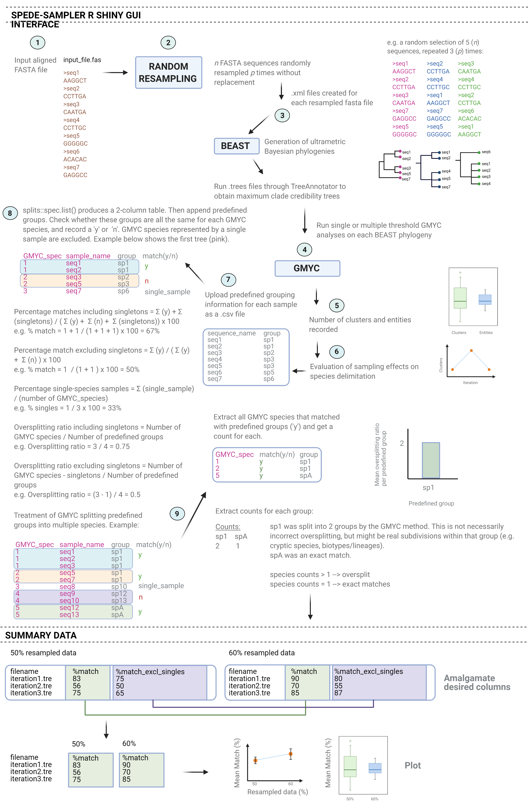

# SPEDE-SAMPLER (GMYC)

*Created by:*

*Clarke van Steenderen*

*Department of Zoology and Entomology*

[*The Centre for Biological Control*](https://www.ru.ac.za/centreforbiologicalcontrol/)

*Rhodes University, Grahamstown, Eastern Cape, South Africa*

*2021*

*e-mail:* vsteenderen@gmail.com

---

## **HOW TO RUN THE APPLICATION**

To run this app through R, type the following into the console:

`install.packages("shiny") # install the shiny package` 

`library(shiny) # load up the shiny library` 

`shiny::runGitHub("spede-sampler", "CJMvS", ref="main") # run the app`

## **OVERVIEW**

This R Shiny App is the final step of the analysis pipeline following from the SPEDE-SAMPLER Python program (see the diagram below). The application requires the user to input a folder directory containing all the tree files created by FastTree or RAxML. If the user wishes to run the analysis on only one tree, this tree file needs to be saved into a folder first, which can then be selected.
Using the "ape" package, each tree is opened and converted to become fully dichotomous (**multi2di()** function) and ultrametric (**chronos()** function).
The GMYC species delimitation algorithm is then run on each tree using the R "splits" package. The number of clusters and entities for each tree is recorded in a dataframe, and can be downloaded and/or plotted in the application under the "Plot Results" tab.
Each GMYC clustering tree can be viewed and downloaded.
If the user has predefined grouping data for their samples, this can be uploaded as an Excel csv file. These predefined groups are then compared to the groups estimated by the GMYC analysis, and a percentage match is calculated.

# **USAGE**

## Tab: Home:multiple ML trees

Select a folder, or manually input the file path containing the files created by either FastTree or RAxML. 
Select the approapriate radio button to indicate which ML program was used to create your tree files.
The file path will display on the screen as confirmation of your choice.

To upload predefined grouping information, browse for the relevant .csv file. 

The csv file needs one column for sample names, and another for their corresponding predefined groups. For example:

| sample_id | group |
|-----------|-------|
| MN1234    | sp1   |
| MN1235    | sp1   |
| MN1236    | sp3   |

 
Where the **group** column could be, for example, morphospecies.
Select which column is the grouping, and which is the sample name column from the dropdown menus.

Click the "Run" button to start the GMYC analysis. 

## Tab: View Data

"Show all data" prints the number of clusters and entities and clusters for each tree file, and "Show summary table" displays the mean, standard deviation, and minimum and maximum values for all the data.

When downloading, add the .csv extension manually to the file name.

## Tab: Plot Results

Display and plot the results for:

- The number of clusters vs the number of entities as a scatter plot
- A boxplot for the numbers of clusters and entities
- The number of clusters and entities estimated by each ML iteration file

When downloading these plots, add the .svg extension to the file name.

## Tab: Plot Trees
Plot any individual GMYC tree with GMYC support values, or original bootstrap support values.

## Tab: Percentage Matches
Select any input tree file, and click on the "View GMYC species list" button to view the GMYC results table with the appended predefined groups (as uploaded by the user).
Click on "View Matches" to view the percentage match including and excluding single-sample GMYC-species, the percentage of single-sample GMYC species, and the oversplitting ratio including and excluding single-sample GMYC-species. 
The "View Matches Summary" button displays the average, standard deviation, and minimum and maximum values for the above statistics.

## Tab: Plot Percentage Matches
Plot the percentage match (GMYC species to predefined groups) for each tree file as a line graph.

## Tab: GMYC Oversplitting
The "View Summary Table" button displays the mean, standard deviation, and minimum and maximum values for the predefined groups that have been split into more than one species/groups by the GMYC algorithm. 
This data can be plotted as a box-and-whisker or bar plot.

## Tab: Plot for multiple-column data
Upload a prepared file with a desired output type for each resampled dataset. For example, percentage matches excluding single-sample GMYC species:

| filename        | 10    | 20   | 30   |
|-----------      |-------|----- |----- |
| iteration1.tre  | 0.25  | 0.3  | 0.36 |
| iteration2.tre  | 0.4   | 0.5  | 0.48 |
| iteration3.tre  | 0.35  | 0.28 | 0.23 |
