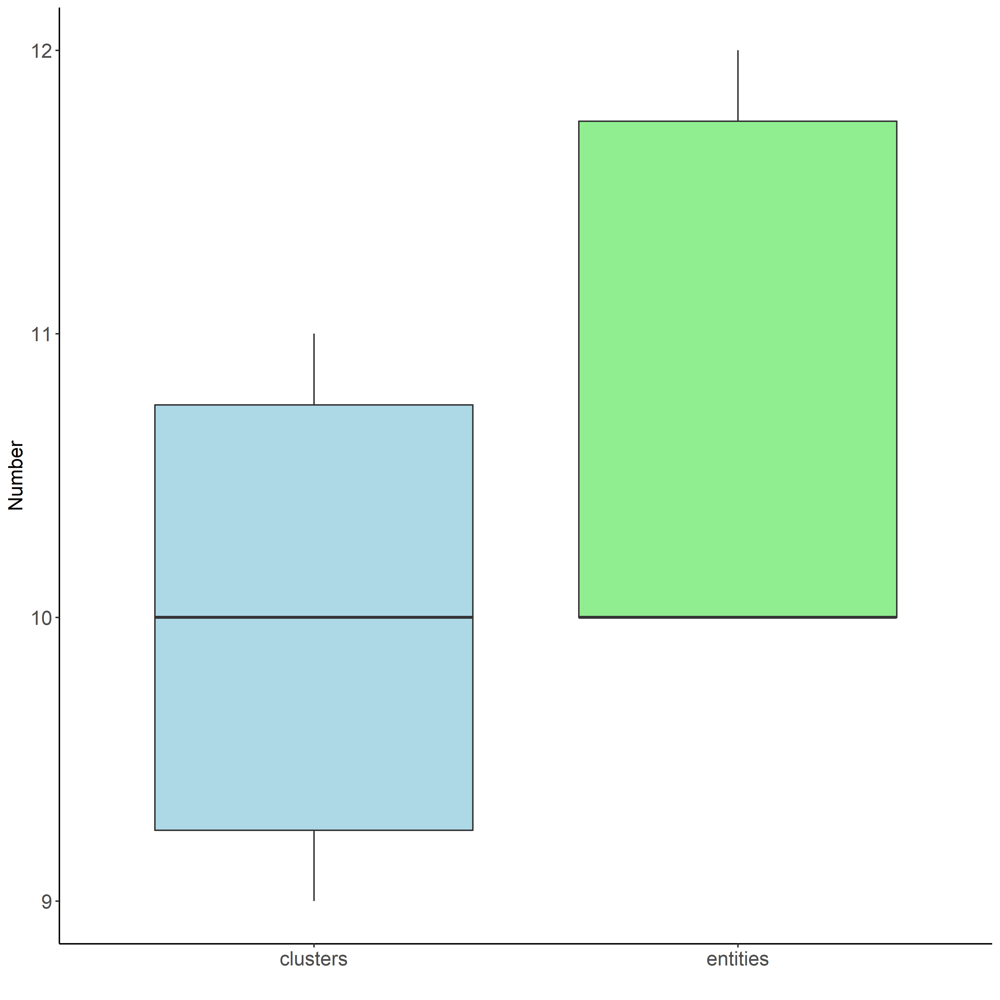
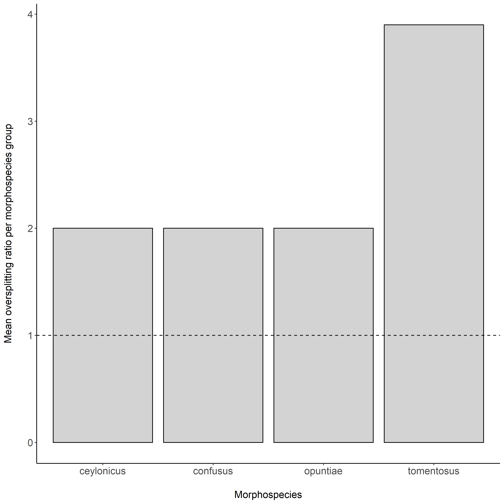

*Clarke van Steenderen* <br />
*Department of Zoology and Entomology* <br />
[*The Centre for Biological Control*](https://www.ru.ac.za/centreforbiologicalcontrol/) <br />
*Rhodes University, Grahamstown/Makhanda, Eastern Cape, South Africa* <br />
*2021* <br />
*e-mail:* vsteenderen@gmail.com

---

## **HOW TO RUN THE R SHINY APPLICATION**

1. Download and unzip the **spede_sampler_R** repository
2. Open R, and install (if applicable) and load the shiny library
3. Install and load the Biostrings package:

```r
if (!requireNamespace("BiocManager", quietly = TRUE))
    install.packages("BiocManager")

BiocManager::install("Biostrings")
library(Biostrings)
```

4. Change the working directory to the downloaded folder
5. Run the application using the **runApp()** function

``` r
install.packages("shiny")
library(shiny)
setwd("path/to/spede_sampler_R-main")
shiny::runApp(appDir = getwd())
```

## **OVERVIEW**

This R Shiny App offers an analysis pipeline for assessing how sampling effects and paramater choices can affect the results of a GMYC analysis. 
The pipeline begins with the uploading of an aligned FASTA file, where a chosen percentage of the dataset is randomly resampled *n* times without replacement. BEAST .xml files are then generated for each resampled FASTA alignment, applying desired configuration settings. Each .xml file is run in BEAST, and the results fed into TreeAnnotator. Maximum clade credibility trees are then used as input for GMYC analyses (single or multiple threshold).
If the user has predefined grouping data for their samples (e.g. morphospecies assignments), this can be uploaded as an Excel .csv file. These predefined groups are compared to the groups estimated by the GMYC analysis, and percentage matches calculated.

This application outputs:
1. The number of clusters and entities estimated by the GMYC method for the uploaded data
2. The percentage matches between predefined groupings and GMYC species estimates; with and without GMYC species represented by single-samples (= singletons)
3. Oversplitting ratios (the ratio of the number of GMYC species to predefined groups)
4. Which predefined groups were split into more than one GMYC species, indicating possible undiscovered diversity
5. Summary plots 

## **FUNCTIONALITY FLOW DIAGRAM**


# **USAGE, TAB-BY-TAB**

## Random Resampling

Insert the file path to an aligned FASTA file (.fas or .fasta extension) in the query box, set the name of the folder to which the results will be written, and then select the percentage of the dataset you wish to resample, and the number of times this must be repeated. Click "Resample".

For example, if your input .fas file contained the following three sequences:

>seq1<br>
AAAGGGTTTAA<br>
>seq2<br>
CCCGGGAAAGT<br>
>seq3<br>
GGTTTAAGGGT<br>

If you wish to randomly select two of these sequences, and iterate the process four times, the program will create four .fas files, which could be for example:

**iteration1.fas:**

>seq2<br>
CCCGGGAAAGT<br>
>sequence1<br>
AAAGGGTTTAA<br>

**iteration2.fas**

>seq2<br>
CCCGGGAAAGT<br>
>seq3<br>
GGTTTAAGGGT<br>

**iteration3.fas**

>seq3<br>
GGTTTAAGGGT<br>
>sequence1<br>
AAAGGGTTTAA<br>

**iteration4.fas**

>seq3<br>
GGTTTAAGGGT<br>
>seq2<br>
CCCGGGAAAGT<br>

## BEAST XML Files

Insert the filepath to the folder containing your randomly-resampled FASTA files. Select the appropriate site and clock model, clock rate, tree prior, distribution rates, MCMC value, and the interval at which to store trees. Insert a name for the folder to which results are written. Click "Generate".

## Run BEAST

Insert the filepath to the folder containing the desired .xml files, optionally select "Run BEAGLE", and click "Run BEAST2". For very large alignment files, it is advisable to delegate this task to [CIPRES](https://www.phylo.org/), and to download the resulting .trees files for further processing.

## Run LogCombiner

This is an optional function to reduce the size of the .trees files generated by BEAST. Set the resampling frequency to a higher multiple of the original value set as "store every" in the generation of the .xml file.

## Run TreeAnnotator

Insert the file path to the folder containing the .trees output from BEAST (or LogCombiner if applicable). Set the desired burnin value, and the "Heights" category. It is advisable to leave the "Low Memory?" option checked. Click "Run".

## Run Tracer

Insert the file path to the folder containing the log files generated by BEAST, set the desired burnin and sample interval values, and select the log file of interest. Click "Results". Check that ESS scores are greater than 200, and that the trace plot resembles a "hairy caterpillar".

## GMYC Analysis

Insert the file path containing the .nex files created by TreeAnnotator. Select the desired GMYC threshold (single is recommended).

To upload predefined grouping information, browse for the relevant .csv file. 

The csv file needs to contain a column for sample names, and one for their corresponding predefined groups. For example:

| sample_id | group | province |
|-----------|-------| -------  |
| MN1234    | sp1   | SW       |
| MN1235    | sp1   | SE       |
| MN1236    | sp3   | NW       |

<br />

Where only the first two columns are of interest, and the **group** column could be, for example, morphospecies.
Click the **Confirm file** button once the file has uploaded.
Select which column comprises the groups, and which is the sample name column from the dropdown menus.

Click the "Run GMYC" button to start the GMYC analysis. 

## View Data

"Print all data to the screen" prints the number of clusters and entities and clusters for each tree file, and "Print summary statistics to the screen" displays the mean, standard deviation, and minimum and maximum values for all the data.

When downloading, add the .csv extension manually to the file name.

## Plot Results

Display and plot the results for:

- The number of clusters vs the number of entities as a scatter plot
- A boxplot for the numbers of clusters and entities
- The number of clusters and entities estimated by each ML iteration file

## Plot Trees

Plot any individual GMYC tree with GMYC support values.

## Percentage Matches

Select any input tree file, and navigate to the "View GMYC species list" panel to view the GMYC results table with the appended predefined groups (as uploaded by the user).
Navigate to "View Matches" to view the percentage match including and excluding single-sample GMYC-species, the percentage of single-sample GMYC species, and the oversplitting ratio including and excluding single-sample GMYC-species. 
The "View Matches Summary" section displays the average, standard deviation, and minimum and maximum values for the above statistics.

## Plot Percentage Matches

Plot the percentage match (GMYC species to predefined groups) for each tree file as a line graph.

## GMYC Oversplitting

The "View summary" button in the "View output" panel displays the mean, standard deviation, and minimum and maximum values for the predefined groups that have been split into more than one species/groups by the GMYC algorithm. The "View full" button gives a table with all the predifined groups that were split into more than one group across all trees.
These data can be plotted as box-and-whisker or bar plots.

## Amalgamate
Upload multiple .csv files containing the output downloaded from the **Percentage Matches** tab. These have the following column layout (e.g. the output for a 50% resampled dataset):

| filename        | percentage_match    | percentage_match_excl_singles   | percentage_single_sample_GMYC_species   | oversplitting_ratio   | oversplitting_excl_singles |
|-----------      |-------|----- |----- |----- | ----- |
| iteration1.tre  | 0.25  | 0.3  | 0.36 | 0.35 | 0.18 |
| iteration2.tre  | 0.4   | 0.5  | 0.48 | 0.35 | 0.25 |
| iteration3.tre  | 0.35  | 0.28 | 0.23 | 0.56 | 0.36 |
| iteration4.tre  | 0.3   | 0.58 | 0.21 | 0.33 | 0.25 |

And an example of the output from a 60% resampled dataset:

| filename        | percentage_match    | percentage_match_excl_singles   | percentage_single_sample_GMYC_species   | oversplitting_ratio   | oversplitting_excl_singles |
|-----------      |-------|----- |----- |----- | ----- |
| iteration1.tre  | 0.35  | 0.36 | 0.40 | 0.45 | 0.28 |
| iteration2.tre  | 0.45  | 0.58 | 0.65 | 0.85 | 0.36 |
| iteration3.tre  | 0.5   | 0.38 | 0.26 | 0.66 | 0.42 |
| iteration4.tre  | 0.45  | 0.68 | 0.28 | 0.35 | 0.2  |

Select which data column you wish to extract from the dropdown menu. The algorithm pulls the desired column data from each uploaded file and binds them into one dataframe. This can then be plotted as a line graph with standard deviations. The **percentage_match** data (first column in the above examples) from the 50% and 60% resampled data will look like this:

| filename        | 50    | 60   | 
|-----------      |-------|----- |
| iteration1.tre  | 0.25  | 0.35 | 
| iteration2.tre  | 0.4   | 0.45 | 
| iteration3.tre  | 0.35  | 0.5  | 
| iteration4.tre  | 0.3   | 0.45 | 

Download this as a .csv file.

## Plot for multiple-column data
Upload the dataframe downloaded from the **Amalgamate** tab and apply the desired plot settings/tweaks. Plot a boxplot and/or barplot of the data and download as an .svg file.


## :pencil2: **Worked Example using cochineal 12S sequences**

The **worked_example.zip** folder contains the output of the [SPEDE-SAMPLER Python GUI program](https://github.com/CJMvS/spede-sampler-py) that randomly resampled 25, 50, 75, and 100% of the 142 cochineal insect sequences in the 12S_aligned FASTA file. Each subsampled dataset contains 10 iterations (performed with a set seed for reproducibility). The 'cochineal_ids' csv file contains predefined species designations for each sequence based on the host plant the specimen was collected from (the cochineal insects display high host-specificity, where a particular species will typically only feed on one cactus species). See the associated [journal article](https://www.sciencedirect.com/science/article/pii/S1049964420306538) for more information about these insects and genetic sequences. There are currently 11 described cochineal species, four of which are used as biological control agents for invasive cactus species. These are *Dactylopius opuntiae*, *D. tomeontosus*, *D. ceylonicus*, and *D. austrinus*. *Dactylopius opuntiae* comprises the "ficus" and "stricta" lineages, and *D. tomentosus* comprises lineages including "cholla", "imbricata", "californica var. parkerii", "bigelovii", and "cylindropuntia".

📌 The **Supplementary data** file contains all the results of this worked example (i.e. the output of the SPEDE-Sampler R shiny application) packaged as an R project with relevant code for generating graphical output.

**Steps:**

1. Download the 12S_aligned.fas file. 
2. Open the SPEDE-SAMPLER-GMYC R Shiny application using the instructions at the start of this README
3. Upload the 12S_aligned.fas file in the **Random resampling** tab. Change the "percentage of sequences to resample" to 25%, the "number of iterations" to 10, and select "Set a seed". Click "Resample". For the remainder of these instructions, repeat the process for 50, 75, and 100% of the data, changing the output folder names accordingly where appropriate.
4. In the **BEAST XML Files** tab, insert the file path to the folder containing the resampled FASTA files of 25% of the dataset. Leave the default settings, changing only the MCMC to 5 000 000, and the output folder name. Click "Generate". 
5. Either run BEAST2 from the **Run BEAST** tab by inserting the file path to the folder containing the desired .xml files, or upload the .xml files to CIPRES and run the analyses on the external server. This is much quicker than running it on your local machine, but slightly more admin. 
6. In the **Run TreeAnnotator** tab, insert the file path to the folder containing the .trees files generated by BEAST. Leave the burnin at 25%, the heights on "median", and the "Low Memory?" button checked. Click "Run".
7. In the **Tracer** tab, check for MCMC convergence, and that ESS scores > 200 for the inputted log files. 
8. In the **GMYC** analysis tab, insert the file path to the folder containing the .trees files generated by TreeAnnotator. Select the single threshold option.
9. Under **Upload a csv file with prior grouping information:**, click **Browse**, and select the **cochineal_ids.csv** file.
10. Under the **Select Group Column:** dropdown menu, select **predefined_group**. Leave the **Select Smaple Name Column** selected from the second dropdown menu.
11. Click the **RUN GMYC** button.
12. Once the analysis is complete, select the **View Data** tab. 
13. The **Print** button in the **Print all data to the screen** displays the number of clusters and entities recorded for each of the 10 iteration files, and the **Print** button in the **Print summary statistics to the screen** panel displays the average, standard deviation, minimum, and maximum values for this data. Both of these dataframes can be downloaded as .csv files. These are the results using the 75% resampled data:

| statistic        | clusters    | entities   | 
|-----------      |-------|----- |
| Average  | 10.0  | 10.7 | 
| Standard deviation  | 0.82   | 0.95 | 
| Minimum  | 9.00  | 10.00  | 
| Maximum  | 11.00   | 12.00 | 

11. The **Plot Results** tab allows for the plotting of the A) the number of clusters vs entities for each tree file, B) box-and-whisker plot for the clusters and entities (showing Q1, Q3, median, minimum, maximum, and outlier values), and a line graph for the number of GMYC C) clusters and D) entities for each tree file uploaded.



12. The **Plot Trees** tab allows for the plotting of any tree from those uploaded. The user can select whether the original FastTree or RAxML bootstrap or GMYC support values should be displayed. 

13. The **Percentage Matches** tab shows the results of how the GMYC species designations compare to the predefined groups in the **cochineal-ids.csv** file.
The **View GMYC species list** button shows a datatable containing each sample name with the assigned GMYC species. The corresponding predefined group given to that particular sample is appended as a third column. For example:

| GMYC_spec | sample_name | ids | 
| ----------- | ----------- | ----------- |
| 1 | VS086uOE | opuntiae |
| 1 | VS086uOE | opuntiae |
| 1 | VS017Ofi | opuntiae |
| 1 | VS015Ofi | opuntiae |
| 1 | CSW004E | opuntiae |

The **View Matches** button displays the percentage matches including and excluding single-sample representatives, the percentage of GMYC species represented by a single sample, and the oversplitting ratio including and excluding single-sample GMYC species. The **View Matches Summary** shows the average, standard deviation, minimum, and maximum values for these measures. 

| statistic        | percentage_matches    | percentage_matches_excl_single_samples   | percentage_single_sample_GMYC_species | oversplitting_ratio | oversplitting_ratio_excl_single_sample_spp |
|--------             |-------|----- |----- |----- |----- |
| Average             | 100.00  | 100.00 | 6.41 | 2.41 | 2.00 |
| Standard deviation  | 0.00  | 0.00 | 4.47 | 2.61 | 0.16 |
| Minimum             | 100.00  | 100.00  | 0.00  | 2.00 | 1.80 |
| Maximum             | 100.00 | 100.00 | 10.00| 2.40 | 2.20 |

14. The **Plot Percentage matches** tab allows for the plotting of the percentage match; A) including or B) excluding GMYC single-sample species for each tree file.

15. The **GMYC Oversplitting** tab displays GMYC species oversplitting relative to the user's predefined groups. The **View Summary Table** button allows the user to download the mean, standard deviation, minimum and maximum oversplitting values for each predefined group.

| predefined_group        | mean    | sd   | min | max |
|-----------      |-------|----- |----- |----- |
| ceylonicus  | 2 | 0 | 2 | 2 |
| confusus  | 2   | 0 | 2 | 2 |
| opuntiae  | 2  | 0 | 2 | 2 |
| tomentosus  | 3.9  | 0.32  | 3 | 4 |

The output above means, for example, that the GMYC method oversplit the *Dactylopius tomentosus* predefined group into an average of 3.9 times more 'species' than expected (i.e. all the samples with the predefined group labelled "tomentosus" are expected to be grouped into one species by the GMYC method). The *D. tomentosus* sequences in this dataset are known to contain different lineages/biotypes. The high value of 3.9 may therefore not be a case of incorrect 'oversplitting', but rather due to genuine intraspecific divisions. Each dataset needs to be analysed in the context of what is known about the organism's biology.

A barplot and boxplot for this data can be created and downloaded: 



16. The **Amalgamate** tab allows the user to upload multiple files downloaded from the **Percentage Matches**  --> **View Matches** --> **Download** button. In this way, the results of the 25, 50, 75, and 100% datasets can be joined into one file in order to be easily plotted. For example, the four files clust_ent_data_25.csv, clust_ent_data_50.csv, clust_ent_data_75.csv, and clust_ent_data_100.csv can be uploaded, and all the cluster data can be amalgamated into one file, and all the entity data into another.
The clusters summary table looks like this:

|                  | 25 | 50 | 75 | 100 |
|------------------|----|----|----|-----|
| resampled_1.nex  | 5  | 7  | 9  | 11  |
| resampled_2.nex  | 4  | 11 | 11 | 11  |
| resampled_3.nex  | 10 | 9  | 11 | 10  |
| resampled_4.nex  | 6  | 10 | 10 | 10  |
| resampled_5.nex  | 6  | 7  | 9  | 10  |
| resampled_6.nex  | 7  | 7  | 10 | 11  |
| resampled_7.nex  | 6  | 8  | 9  | 10  |
| resampled_8.nex  | 5  | 9  | 10 | 11  |
| resampled_9.nex  | 5  | 11 | 10 | 10  |
| resampled_10.nex | 4  | 8  | 11 | 10  |

and the entities table looks like this:

|                  | 25 | 50 | 75 | 100 |
|------------------|----|----|----|-----|
| resampled_1.nex  | 7  | 9  | 10 | 12  |
| resampled_2.nex  | 8  | 13 | 12 | 12  |
| resampled_3.nex  | 15 | 10 | 12 | 10  |
| resampled_4.nex  | 7  | 12 | 11 | 10  |
| resampled_5.nex  | 8  | 9  | 10 | 10  |
| resampled_6.nex  | 8  | 9  | 10 | 12  |
| resampled_7.nex  | 9  | 9  | 10 | 10  |
| resampled_8.nex  | 8  | 9  | 10 | 12  |
| resampled_9.nex  | 6  | 11 | 10 | 10  |
| resampled_10.nex | 7  | 9  | 12 | 10  |
